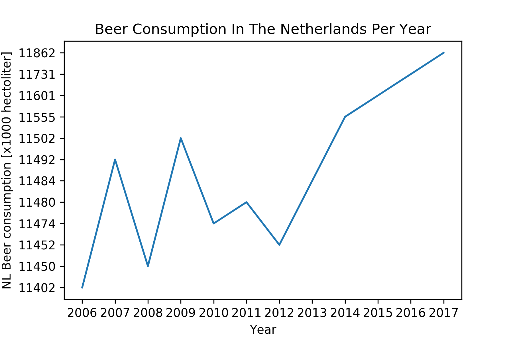

MCC Van Dyke et al., 2019: "Fantastic yeasts and where to find them: the hidden diversity of dimorphic fungal pathogens" 
JT Harvey, Applied Ergonomics, 2002: "An analysis of the forces required to drag sheep over various surfaces" 
DW Ziegler et al., 2005: "The neurocognitive effects of alcohol on adolescents and college students" 

The figure below shows the beer consumption in The Netherlands per year in hectoliters. The values on the y-axis must be multiplied by a 1000. After a fluctuation in the time period between 2006 and 2012, a large increase in beer consumption can be seen between the years 2012 and 2017. 
